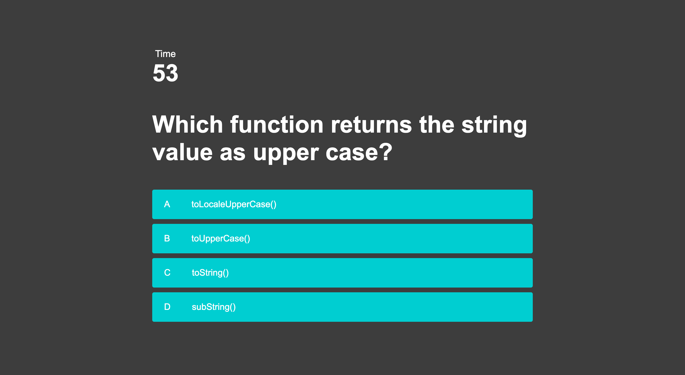

# code_quiz

This coding quiz asks users a series of multiple choice questions to guage their knowlege of JavaScript's functionality and terminology.  The user begins by pressing the start button on the index.html page, which takes them to to quiz page itself.  Once in the quiz page, the timer starts automatically from sixty seconds and counts down to zero. The user has that alloted time in which to answer the five questions. The user clicks on the answer to select it and a new question is generated. Should the user select the incorrect answer from the list, a penalty of 10 seconds is subtracted from the timer at the top of the page. When the user has finished the quiz, the remaining time is recorded as their score, they are asked to enter their initials and are taken to the high scores page. Once in the high scores page, they are given the option of clearing the high scores or begining the quiz again.

